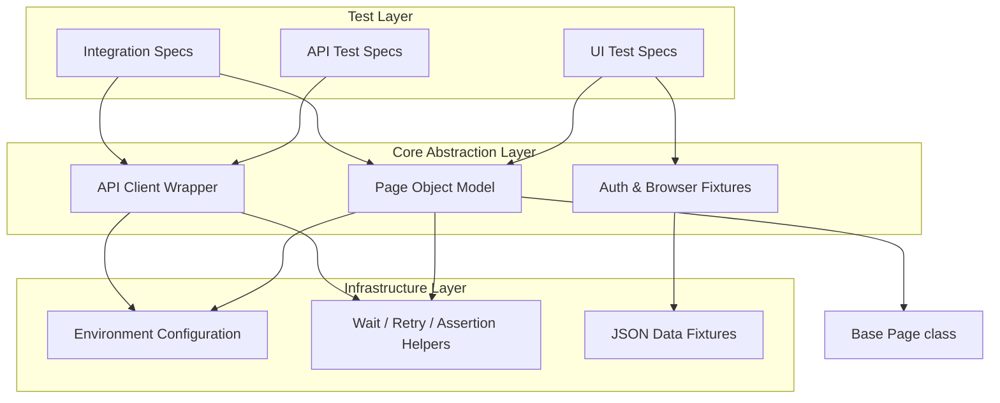

# TestMu AI SDET-2 Quality Engineering Framework

A state-of-the-art, production-grade test automation framework built using **TypeScript**, **Playwright**, and **Allure**, designed to deliver bulletproof QA signals for rapid-deployment cycles. This repository implements modern software engineering practices to address scale, reliability, and framework maintenance.

---

## 🏗️ Architecture Overview

This framework is built on a highly modular and structured architecture that completely separates test logic from browser mechanisms and dynamic test data.



### Key Pillars
1. **TypeScript Native**: Enforces strict compile-time safety and self-documenting code.
2. **Page Object Model (POM)**: Enforces complete isolation between UI elements/interactions and test scripts.
3. **Data-Driven Strategy**: Externalizes static scenarios, payloads, and mock credentials into typed JSON fixtures.
4. **Encapsulated API Engine**: Leverages Playwright's native `APIRequestContext` for blazingly fast HTTP validation.
5. **Unified Authentication State**: serializes the authentication cookie/local storage state, allowing multiple parallel execution workers to bypass standard UI login routines.
6. **Resilient Utilities**: Implements intelligent retries (exponential backoff) and wait-poll conditions to eradicate flakiness.

---

## 🚀 Setup & Execution Steps

### 1. Installation
Clone the repository and install the dependencies:
```bash
npm install
```

### 2. Browser Binaries Setup
Install the necessary Playwright browser binaries:
```bash
npx playwright install --with-deps
```

### 3. Environment Configuration
Copy the environment variables template and configure your values:
```bash
cp .env.example .env
```
Update `.env` with actual credentials, API URLs, and target UI URLs:
```env
BASE_URL=https://app.example.com
API_BASE_URL=https://api.example.com
TEST_USER_EMAIL=admin@example.com
TEST_USER_PASSWORD=securepassword
CI=false
```

### 4. Running Tests

* **Run all tests:**
  ```bash
  npm test
  ```
* **Run UI tests only:**
  ```bash
  npm run test:ui
  ```
* **Run API tests only:**
  ```bash
  npm run test:api
  ```
* **Run Integration tests only:**
  ```bash
  npm run test:integration
  ```
* **Generate and view reports:**
  ```bash
  npm run test:report
  ```

---

## 💡 Design Decisions

### Why Playwright over Cypress?
- **True Multi-Tab & Native Multi-Browser**: Playwright supports native multi-browser instances (Chromium, WebKit, Firefox) running concurrently and offers full support for multiple tabs and frames.
- **Out-of-Process Execution**: Playwright interacts directly with browser debug protocols (CDP/WebDriverBiDi), rendering it immune to local iframe execution constraints and page-navigation hang-ups typical in Cypress.
- **Superior Parallelization**: Shards test scripts out-of-the-box using worker nodes without expensive subscription requirements.
- **Native API Testing**: Playwright's built-in request model is incredibly light and shares browser cookies, allowing seamless integration flows.

### Why the Page Object Model (POM)?
- **DRY (Don't Repeat Yourself)**: Keeps element identifiers, custom controls, and page-specific logic under a single class. Changes to elements require modifications only within the page class, leaving test specs untouched.
- **Readability**: Abstracting raw locators behind clean method invocations makes tests read like natural business flows (e.g., `await loginPage.login(email, password)`).

### Why GitHub Actions (Task 3 Option A) over Option B?
- **Immediate QA Signal**: For teams delivering continuously, a blocking CI gate provides an instant, automated health indicator for every push and Pull Request.
- **Preventing Regression Influx**: Standardizing feedback at commit-time ensures broken builds never cross branches. A reporting dashboard is extremely valuable once the feedback loop is stable; however, CI gating builds the foundation of trust.

---

## 🛠️ API Endpoint Constants (update before running)

All endpoints used across our specs are fully centralized at the top of the API wrapper class. Below are the current paths representing our abstract Application Under Test (AUT) endpoints:

| Logical Endpoint | AUT HTTP Method | Path |
|---|---|---|
| **Authentication Link** | `POST` | `/api/v1/auth/login` |
| **Resource Root** | `GET` / `POST` | `/api/v1/resources` |
| **Individual Resource** | `GET` / `PUT` / `DELETE` | `/api/v1/resources/{id}` |
| **Admin Authorization Check** | `GET` | `/api/v1/admin/dashboard` |

---

## 🔮 What to Build Next (Future Roadmap)

Given additional sprint cycles, the following additions would be prioritized:
1. **Accessibility Testing (a11y)**: Integrate `@axe-core/playwright` into the UI pipeline to continuously check WCAG compliance.
2. **Visual Regression Testing**: Add Playwright visual comparisons (`expect(page).toHaveScreenshot()`) or tools like Percy/Applitools to catch CSS and layouts degradation.
3. **Contract Testing**: Implement Pact framework integrations between front-end UI calls and mock APIs to catch API specification shifts early.
4. **Synthetic Monitoring**: Reuse core page classes within tools like Datadog Synthetics to verify critical deployment paths continuously in production.
