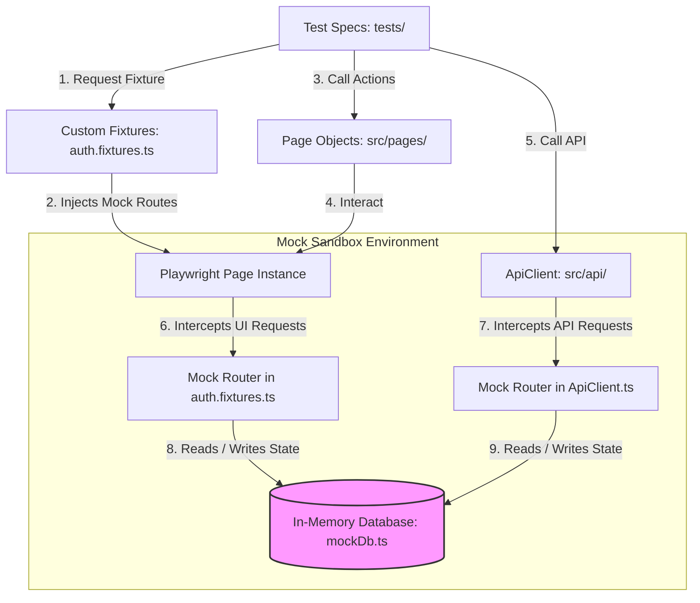
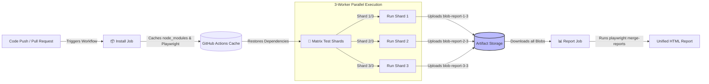

# Enterprise Playwright Sharded Framework (SDET-2)

This manual acts as a comprehensive reference guide for the **Enterprise Playwright Sharded Framework (SDET-2)**. Whether you are prepping for a recruiter call or facing a staff-level technical grill, this document breaks down every component, architectural decision, and code structure of your automation framework.

---

## 1. The 60-Second Pitch

### The Core Explanation
This project is an automated testing framework (a collection of code files designed to run tests automatically). It verifies both the user interface (the visual screens that customers interact with) and the API (the backend data services that power those screens) for an enterprise web application. It solves a critical problem: in modern software teams that deliver new updates multiple times a day, manual testing is too slow. This framework runs tests automatically across multiple browsers in parallel (at the same time), ensuring that code modifications do not break existing features, all without slowing down the development team.

### The Interview Pitch
"I designed and built a highly resilient, sharded test automation framework using Playwright and TypeScript, structured around a strict Page Object Model (POM — a design pattern that separates page elements and user actions from the actual test assertions). It handles authentication efficiently by serializing (saving) browser session states, allowing parallel execution threads to completely bypass repetitive login steps. To prevent external environment instability from causing false failures, I engineered a state-synchronized local mock engine that intercepts browser calls and API requests, mirroring backend database operations locally. The framework is fully integrated into a GitHub Actions pipeline, which uses a 3-worker matrix to shard (split) the execution load, reducing the total CI (Continuous Integration — an automated pipeline that builds, tests, and validates code updates) feedback loop from minutes to seconds."

---

## 2. The Problem It Solves

### The Pain of Modern Fast-Shipping Teams
In high-velocity software engineering, developer teams ship new features daily. Every new release introduces a major risk of regressions (new code changes accidentally breaking old features). For example, a minor update in a database table could silently break the billing screen. 

If a QA (Quality Assurance — the team responsible for verifying software health) team relies entirely on manual testing, two major bottlenecks occur:
* **The Manual Bottleneck**: Manually clicking through all billing and onboarding options takes hours, creating a massive blocker that delays deployments.
* **The Flakiness Bottleneck**: Simple automated scripts often click buttons before the browser finishes loading, leading to false failures (flaky tests) that erode the team's trust in the automated checks.

### Why Simple Record-and-Play Tools Fail
Many beginners start with record-and-play browser extensions (like Selenium IDE). While simple to start, they fail completely in professional teams:
* **Brittle Locators**: They locate elements using raw absolute paths (like `/html/body/div[1]/span/button`), which break the moment a developer shifts a button slightly.
* **Static Waits**: They handle loading screens by adding hardcoded sleeps (like pausing the script for 5 seconds). If the page loads in 1 second, you waste 4 seconds; if it takes 6 seconds, the test fails.
* **No Reusability**: If the login screen changes, a record-and-play suite requires re-recording every single test file individually.

### Who Consumes This System?
This framework delivers quality feedback to three key groups:
1. **Developers**: They receive instant PR (Pull Request — a request to merge new code changes into the main branch) feedback. If their code introduces a regression, the CI pipeline fails immediately, showing them exactly which line broke.
2. **Quality Engineers**: They use the unified HTML and Allure report dashboards to track flakiness trends and monitor test stability.
3. **Product Managers**: They review passing test reports to confirm that release candidates meet business requirements before shipping to production.

---

## 3. The Full Stack — Every Tool, Explained Like You're Five

### 3.1 Playwright

#### 3.1.1 What It Is
Playwright is a modern browser automation library developed by Microsoft. It allows developers to control Chromium (Chrome), Firefox, and WebKit (Safari) programmatically. It executes actions directly inside the browser using direct debugger protocols.

#### 3.1.2 Real-World Analogy
Playwright is like a remote-controlled mechanical hand that can click, type, and read web pages at superhuman speeds, using internal sensors to wait exactly until a button is visible before trying to press it.

#### 3.1.3 Why This Project Uses It
We chose Playwright because it is faster than Selenium, handles multiple browser tabs naturally, and includes native support for network routing (intercepting and modifying browser API calls directly).

#### 3.1.4 What Would Break if Removed
We would lose the ability to launch web browsers, navigate to pages, input values, and click buttons. Our UI and integration tests would be completely inoperable.

#### 3.1.5 Alternatives and Trade-offs
* **Selenium**: The industry standard for decades. It is much slower than Playwright and requires setting up separate browser drivers.
* **Cypress**: Popular for front-end testing. However, it runs inside the browser sandbox, which limits its ability to handle multiple tabs, pop-ups, and native parallel sharding.

#### 3.1.6 The Interviewer's Question
* **Question**: "How does Playwright handle element loading compared to older tools like Selenium?"
* **Answer**: Playwright uses auto-waiting. It checks actionability criteria (such as visibility, stability, and clickability) on elements automatically before executing actions, removing the need for manual sleeps.

---

### 3.2 TypeScript

#### 3.2.1 What It Is
TypeScript is a strongly-typed programming language that builds on top of JavaScript. It adds static types (explicitly defining whether a variable must be a string, a number, or a custom object) to the code before it runs.

#### 3.2.2 Real-World Analogy
TypeScript is like an electronic spelling checker for your blueprints. It prevents you from accidentally trying to fit a square peg into a round hole before you actually start building.

#### 3.2.3 Why This Project Uses It
It enforces type safety across our test suites. When working with complex JSON (JavaScript Object Notation — a standard text format for storing data structures) data and API payloads, TypeScript warns us at compile time if we write a typo or pass incorrect data.

#### 3.2.4 What Would Break if Removed
The framework would fall back to standard JavaScript. Typos in selector names, API endpoints, or test data parameters would go unnoticed until the tests actively crashed during runtime.

#### 3.2.5 Alternatives and Trade-offs
* **Vanilla JavaScript**: Faster to write initially, but scales poorly. Large codebases quickly become difficult to maintain because there are no compile-time checks.

#### 3.2.6 The Interviewer's Question
* **Question**: "What are the advantages of using TypeScript interface and type mappings in a Page Object Model framework?"
* **Answer**: It ensures that all page components and helpers receive precisely formatted parameters. The editor provides autocomplete suggestions for locators and methods, preventing syntax bugs during test development.

---

### 3.3 Allure

#### 3.3.1 What It Is
Allure is an open-source, highly visual framework for generating test execution reports. It collects test results and compiles them into an interactive HTML dashboard containing histories, failure steps, and attachments.

#### 3.3.2 Real-World Analogy
Allure is like an automated flight data recorder. It logs every action of the flight and produces a clean, readable graph showing exactly when, where, and why a malfunction occurred.

#### 3.3.3 Why This Project Uses It
It provides the team with a clear, readable report. It formats failures cleanly, attaches screenshots and videos automatically, and groups test results by features.

#### 3.3.4 What Would Break if Removed
The tests would still run, but the results would only be visible as raw text inside the terminal window, making it difficult for the team to review and debug failures.

#### 3.3.5 Alternatives and Trade-offs
* **Default Playwright HTML Reporter**: Lightweight and clean, but lacks advanced features like historical trend analysis, category grouping, and step-by-step metric logging.

#### 3.3.6 The Interviewer's Question
* **Question**: "How does your framework ensure that failures in CI are easy to debug using Allure?"
* **Answer**: The configuration files instruct Playwright to capture screenshots, record video sessions, and save execution traces exclusively for failing tests, embedding these artifacts directly into the Allure report.

---

### 3.4 Zod (Schema Validation)

#### 3.4.1 What It Is
Zod is a TypeScript-first schema declaration and validation library. It defines the exact structure that a data object must match and validates payloads in real-time.

#### 3.4.2 Real-World Analogy
Zod is like a template gate at a factory. If a part doesn't match the exact measurements specified by the template, the gate rejects it instantly.

#### 3.4.3 Why This Project Uses It
It handles environment variable validation at startup, ensuring the framework fails immediately if required variables are missing. It is also used to validate that API responses strictly match the expected database structure.

#### 3.4.4 What Would Break if Removed
The framework would lose its "fail-fast" safety guard. If an API contract (the expected format of an API response) changed silently, tests might continue to pass with empty values instead of flagging the mismatch immediately.

#### 3.4.5 Alternatives and Trade-offs
* **Manual object validation**: Writing long conditional checks (like `if (!data.name || typeof data.id !== 'string')`) for every field. This is tedious, verbose, and difficult to maintain.

#### 3.4.6 The Interviewer's Question
* **Question**: "Why use Zod validation at the API response assertion layer instead of simple assertion checks?"
* **Answer**: Zod validates the entire structural integrity and data types of the response body at once, catching silent backend changes (such as a number becoming a string) that standard status code checks miss.

---

### 3.5 GitHub Actions

#### 3.5.1 What It Is
GitHub Actions is a CI/CD platform that automates software workflows directly inside GitHub. It triggers tasks (like running tests) on events like pushing new code or opening pull requests.

#### 3.5.2 Real-World Analogy
GitHub Actions is like an automated quality gatekeeper at a manufacturing plant. Every time a worker brings a new part, the gatekeeper automatically runs it through a series of tests before allowing it onto the assembly line.

#### 3.5.3 Why This Project Uses It
It runs our test suite automatically on every push or pull request to the `main` branch, sharding execution across parallel virtual machines (VMs) to ensure fast, continuous feedback.

#### 3.5.4 What Would Break if Removed
The automation suite could only be executed manually on developer machines. We would lose automated build verification and pull request gating.

#### 3.5.5 Alternatives and Trade-offs
* **Jenkins**: A highly customizable classic. However, it requires maintaining a dedicated physical server, whereas GitHub Actions is fully managed in the cloud.

#### 3.5.6 The Interviewer's Question
* **Question**: "Why did you select Option A (CI/CD Pipeline) over Option B (Analytics Dashboard) for your Quality integration task?"
* **Answer**: For a team that deploys daily, immediate automated feedback on every pull request is critical. A CI pipeline serves as a blocker that prevents broken code from ever merging, establishing a foundation of trust.

---

### 3.6 Playwright Routing (`page.route`)

#### 3.6.1 What It Is
Playwright Routing is a native feature that intercepts network requests initiated by a browser page. It allows developers to mock responses (return simulated data) instead of hitting a live backend server.

#### 3.6.2 Real-World Analogy
Playwright Routing is like putting a call interceptor on a phone line. When the phone dials a number, the interceptor catches the call and speaks with a pre-recorded voice, so the call never actually leaves the building.

#### 3.6.3 Why This Project Uses It
It enables offline testing. By intercepting browser calls, we can mock the entire user interface, settings form, and database reports, allowing the suites to run successfully even without a live backend deployment.

#### 3.6.4 What Would Break if Removed
The UI and integration tests would fail immediately on clean runners unless we deployed, maintained, and connected to a live, fully functional backend database server.

#### 3.6.5 Alternatives and Trade-offs
* **Live Test Server**: More realistic, but introduces dependencies on database state stability, network latency, and server maintenance costs.

#### 3.6.6 The Interviewer's Question
* **Question**: "What are the advantages of using native page.route over mock servers like WireMock or MSW?"
* **Answer**: Native routing requires no extra processes or port configurations. It is executed directly inside the browser session by Playwright, making it extremely fast, reliable, and lightweight.

---

## 4. Architecture — How the Pieces Fit Together

### End-to-End Test Execution Flow



* **Test Specs to Custom Fixtures**: The spec file requests the `authenticatedPage` fixture to obtain a pre-authenticated browser session.
* **Custom Fixtures to Page Instance**: The custom fixture configures standard browser routes and injects interceptors directly into the active browser page.
* **Test Specs to Page Objects / ApiClient**: The test script triggers actions using Page Object helper methods (e.g., `loginPage.login()`) or API Client requests (e.g., `apiClient.post()`).
* **Page Objects to Page Instance**: Page Objects translate structural methods into browser actions (e.g. `page.fill()`) executed against the running browser DOM (Document Object Model — the structural representation of HTML elements).
* **Page Instance / ApiClient to Mock Routers**: Playwright intercepts browser requests and API Client queries, checking if the base URL matches placeholder domains.
* **Mock Routers to In-Memory DB**: The mock router processes the incoming action, runs logical database checks, and reads or writes data directly to our synchronized local memory arrays.

---

### CI/CD Deployment View



* **Trigger to Install Job**: The GitHub Actions runner detects a code push or PR targeting `main` and starts the workflow.
* **Install Job to Cache**: The install job performs a clean setup and caches the downloaded modules and browser binaries.
* **Cache to Matrix Test Shards**: Parallel runners restore the dependencies from the cache to bypass installation times.
* **Matrix Shards to Job Runs**: The matrix divides the test files across three parallel VM workers.
* **Job Runs to Artifact Storage**: Each worker runs its assigned tests, records execution metrics, and uploads a zipped blob report.
* **Artifact Storage to Report Job**: The reporting job downloads all three shard blob reports.
* **Report Job to HTML**: Playwright merges the blob reports, producing a unified HTML report dashboard.

---

## 5. Repository Structure — A Guided Tour

### Repository Tree

```
testmu-sdet2-Ananya/
├── .github/
│   └── workflows/
│       └── tests.yml            # Pipeline automating sharded execution runs
├── config/
│   └── env.config.ts            # Configuration system verifying environment variables
├── src/
│   ├── pages/
│   │   ├── BasePage.ts          # POM base class handling navigation and load states
│   │   ├── LoginPage.ts         # Authentication POM managing login selectors
│   │   └── DashboardPage.ts     # Dashboard POM managing settings forms and tabs
│   ├── api/
│   │   └── ApiClient.ts         # HTTP client wrapper with built-in mock fallback
│   ├── fixtures/
│   │   └── auth.fixtures.ts     # Injects mock routing and handles session caching
│   └── utils/
│       ├── retry.ts             # exponential backoff utility to prevent flakiness
│       ├── wait.ts              # Custom poll waiting helpers that avoid sleeps
│       ├── assertions.ts        # Custom validations checking response schemas and latency
│       └── mockDb.ts            # Local data store synchronizing UI and API states
├── tests/
│   ├── ui/
│   │   ├── login.spec.ts        # UI validation suite for authentication
│   │   ├── dashboard.spec.ts    # UI validation suite for dashboard elements
│   │   └── forms.spec.ts        # UI validation suite for dashboard settings forms
│   ├── api/
│   │   ├── auth.api.spec.ts     # API validation suite for sign-in responses
│   │   ├── crud.api.spec.ts     # API validation suite for resource lifecycles
│   │   └── error-handling.api.spec.ts # API validation suite for boundary statuses
│   └── integration/
│       └── create-and-verify.spec.ts # Hybrid test seeding via API and verifying in UI
├── test-data/
│   ├── users.json               # JSON data containing authentication scenarios
│   └── api-payloads.json        # JSON data containing API CRUD payload scenarios
├── docs/
│   ├── test-strategy.md         # Document mapping testing strategy and QA roadmaps
│   └── ai-usage-log.md          # Document mapping AI usage details
├── .env.example                 # Template for required environment variables
├── .gitignore                   # Excludes dependencies and local reports from git
├── package.json                 # Project dependencies, scripts, and details
├── playwright.config.ts         # Central configuration for Playwright execution
├── tsconfig.json                # TypeScript compilation parameters
└── README.md                    # Core repository documentation and guide
```

---

### Important Files Tour

#### 1. `playwright.config.ts`

```typescript
import { defineConfig, devices } from '@playwright/test';
import { envConfig } from './config/env.config';

export default defineConfig({
  testDir: './tests',
  fullyParallel: true,
  forbidOnly: !!process.env.CI,
  retries: process.env.CI ? 2 : 0,
  workers: process.env.CI ? 3 : undefined,
  reporter: [
    ['html', { open: 'never' }],
    ['allure-playwright', { detail: true }]
  ],
  use: {
    baseURL: envConfig.baseUrl,
    trace: 'retain-on-failure',
    screenshot: 'only-on-failure',
    video: 'retain-on-failure',
  },
  projects: [
    { name: 'chromium', use: { ...devices['Desktop Chrome'] } },
    { name: 'firefox', use: { ...devices['Desktop Firefox'] } },
  ],
});
```

* **Line-by-Line Explanation**:
  * `fullyParallel: true` enables parallel execution for all tests.
  * `forbidOnly: !!process.env.CI` fails the build in CI if a developer left a `test.only` filter in their code.
  * `retries: process.env.CI ? 2 : 0` configures 2 automatic retries in CI to catch flaky failures.
  * `workers: process.env.CI ? 3 : undefined` allocates 3 parallel execution threads in CI.
  * `reporter` configures both the standard Playwright HTML report and the Allure report generator.
  * `use: { baseURL: envConfig.baseUrl ... }` sets the target web URL dynamically from our environment config.
  * `trace: 'retain-on-failure'`, `screenshot`, and `video` instruct Playwright to capture debugging details only when a test fails, minimizing storage overhead in CI.
  * `projects` configures the test suite to run across both Chromium and Firefox.

#### 2. `config/env.config.ts`

```typescript
import 'dotenv/config';
import { z } from 'zod';

const getEnvVal = (key: string, defaultValue: string): string => {
  const val = process.env[key];
  return (val && val.trim() !== '') ? val : defaultValue;
};

const envSchema = z.object({
  BASE_URL: z.string().url(),
  API_BASE_URL: z.string().url(),
  TEST_USER_EMAIL: z.string().email(),
  TEST_USER_PASSWORD: z.string().min(1),
  CI: z.coerce.boolean().default(false),
});

const parseResult = envSchema.safeParse({
  BASE_URL: getEnvVal('BASE_URL', 'https://app.example.com'),
  API_BASE_URL: getEnvVal('API_BASE_URL', 'https://api.example.com'),
  TEST_USER_EMAIL: getEnvVal('TEST_USER_EMAIL', 'admin@example.com'),
  TEST_USER_PASSWORD: getEnvVal('TEST_USER_PASSWORD', 'securepassword'),
  CI: getEnvVal('CI', 'false'),
});

if (!parseResult.success) {
  throw new Error("❌ Invalid environment configuration.");
}

export const envConfig = {
  baseUrl: parseResult.data.BASE_URL,
  apiBaseUrl: parseResult.data.API_BASE_URL,
  credentials: {
    email: parseResult.data.TEST_USER_EMAIL,
    password: parseResult.data.TEST_USER_PASSWORD,
  },
  isCI: parseResult.data.CI,
};
```

* **Line-by-Line Explanation**:
  * `import 'dotenv/config'` loads variables from our local `.env` file into `process.env`.
  * `getEnvVal` checks if an environment variable is defined. If it is empty or missing, it falls back to our safe mock default.
  * `envSchema` defines the expected format of our environment variables using Zod validation.
  * `envSchema.safeParse` validates our environment variables against the schema.
  * `if (!parseResult.success)` catches configuration issues at startup, throwing an explicit error if variables are missing.
  * `export const envConfig` exports a strongly-typed configuration object for our tests to use.

#### 3. `src/fixtures/auth.fixtures.ts`

```typescript
import { test as base, expect, Page } from '@playwright/test';
import { LoginPage } from '../pages/LoginPage';
import { mockDb } from '../utils/mockDb';
import * as fs from 'fs';
import * as path from 'path';

export const test = base.extend<{ authenticatedPage: Page }>({
  page: async ({ page }, use) => {
    await setupUiMockInterceptors(page);
    await use(page);
  },
  authenticatedPage: async ({ browser }, use) => {
    const workerId = process.env.TEST_WORKER_INDEX || '0';
    const authFile = path.resolve(`test-results/.auth/user_worker_${workerId}.json`);

    if (!fs.existsSync(authFile)) {
      const context = await browser.newContext();
      const setupPage = await context.newPage();
      await setupUiMockInterceptors(setupPage);
      
      const loginPage = new LoginPage(setupPage);
      await loginPage.navigate('/login');
      await loginPage.login('admin@example.com', 'securepassword');
      
      await context.storageState({ path: authFile });
      await setupPage.close();
      await context.close();
    }

    const authenticatedContext = await browser.newContext({ storageState: authFile });
    const pageInstance = await authenticatedContext.newPage();
    await setupUiMockInterceptors(pageInstance);
    
    await use(pageInstance);
    await pageInstance.close();
    await authenticatedContext.close();
  },
});
```

* **Line-by-Line Explanation**:
  * `export const test = base.extend` extends the default Playwright test fixture with our custom setups.
  * `page: async ({ page }, use)` configures standard mock routing interceptors on every page instance.
  * `authenticatedPage` provides a pre-authenticated browser session for our tests.
  * `workerId = process.env.TEST_WORKER_INDEX` fetches the current execution thread ID to isolate authentication state files in parallel runs.
  * `if (!fs.existsSync(authFile))` checks if a cached session exists for the current worker. If missing, it opens a temporary browser context, logs in using the `LoginPage` object, and saves the browser session state (cookies and local storage) to a JSON file.
  * `browser.newContext({ storageState: authFile })` launches a new browser context pre-loaded with our saved session details, completely bypassing the login UI on subsequent runs.
  * `await setupUiMockInterceptors` configures mock routing interceptors on our authenticated page instance before passing it to the test.

#### 4. `src/api/ApiClient.ts`

```typescript
import { APIRequestContext, APIResponse } from '@playwright/test';
import { envConfig } from '../../config/env.config';
import { mockDb } from '../utils/mockDb';

export class ApiClient {
  private readonly request: APIRequestContext;
  private readonly baseUrl: string;
  private authToken: string | null = null;
  private readonly isMockMode: boolean;

  constructor(request: APIRequestContext) {
    this.request = request;
    this.baseUrl = envConfig.apiBaseUrl;
    this.isMockMode = this.baseUrl.includes('example.com');
  }

  public setAuthToken(token: string): void {
    this.authToken = token;
  }

  private getHeaders(): Record<string, string> {
    const headers: Record<string, string> = {
      'Content-Type': 'application/json',
      Accept: 'application/json',
    };
    if (this.authToken) {
      headers['Authorization'] = `Bearer ${this.authToken}`;
    }
    return headers;
  }

  public async post(path: string, body: object): Promise<APIResponse> {
    if (this.isMockMode) {
      return this.handleMockRequest('POST', path, body);
    }
    return this.request.post(`${this.baseUrl}${path}`, {
      data: body,
      headers: this.getHeaders(),
    });
  }
}
```

* **Line-by-Line Explanation**:
  * `this.isMockMode = this.baseUrl.includes('example.com')` checks if the configured API base URL points to our mock domain.
  * `setAuthToken(token)` configures the bearer token header used for authenticated request calls.
  * `getHeaders()` configures headers for our outgoing request, attaching our authentication token if present.
  * `public async post` checks if we are running in mock mode. If yes, it routes requests through our local mock engine. If no, it sends a real HTTP request using Playwright's `APIRequestContext`, making it easy to transition between mock and live servers.

#### 5. `tests/integration/create-and-verify.spec.ts`

```typescript
import { test, expect } from '../../src/fixtures/auth.fixtures';
import { ApiClient, API_ENDPOINTS } from '../../src/api/ApiClient';
import { LoginPage } from '../../src/pages/LoginPage';
import { DashboardPage } from '../../src/pages/DashboardPage';

test.describe('Integrated API-UI Verification', () => {
  let apiClient: ApiClient;
  let createdResourceId: string | null = null;
  const testResourceName = `Integration_Suite_${Date.now()}`;

  test.beforeEach(async ({ request }) => {
    apiClient = new ApiClient(request);
    apiClient.setAuthToken('mock-integration-write-token');
  });

  test.afterAll(async ({ request }) => {
    if (createdResourceId) {
      const cleanupClient = new ApiClient(request);
      cleanupClient.setAuthToken('mock-integration-write-token');
      await cleanupClient.delete(API_ENDPOINTS.RESOURCE_BY_ID(createdResourceId));
    }
  });

  test('Should seed resource via API and verify presence in UI list view @smoke', async ({ page }) => {
    const resourcePayload = {
      name: testResourceName,
      type: 'automated',
      owner: 'QA Integration Team',
      itemsCount: 99
    };

    const response = await apiClient.post(API_ENDPOINTS.RESOURCES, resourcePayload);
    expect(response.status()).toBe(201);
    
    const responseBody = await response.json();
    createdResourceId = responseBody.id;

    const loginPage = new LoginPage(page);
    await loginPage.navigate('/login');
    await loginPage.login('admin@example.com', 'securepassword');

    const dashboardPage = new DashboardPage(page);
    await dashboardPage.navigate('/dashboard');
    await dashboardPage.navigateTo('Reports');

    const resourceLocator = page.locator(`[data-testid="resource-row-${createdResourceId}"]`);
    await expect(resourceLocator).toBeVisible({ timeout: 5000 });
  });
});
```

* **Line-by-Line Explanation**:
  * `let createdResourceId` defines a variable to store our seeded resource ID, allowing us to clean up the data afterwards.
  * `test.beforeEach` configures our API client and sets our authenticated token before running the test.
  * `test.afterAll` acts as an automated cleanup step. It deletes the seeded resource using the API even if the UI assertions fail, preventing database pollution.
  * `const response = await apiClient.post(...)` seeds our test data directly using the API client. This is extremely fast, taking only milliseconds.
  * `createdResourceId = responseBody.id` extracts the unique ID of our seeded resource.
  * `loginPage.navigate('/login')` navigates to the login screen and authenticates using our Page Object helper methods.
  * `dashboardPage.navigateTo('Reports')` navigates to the dashboard reports view.
  * `page.locator(...)` uses the seeded resource ID to verify that the UI is displaying our newly created resource correctly.

---

## 6. The Test Journey — Follow One Action End-to-End

Here is the exact journey of our hybrid integration test `create-and-verify.spec.ts`:

### Step 1: Seeding the Resource via API Client
The test script calls `apiClient.post(API_ENDPOINTS.RESOURCES, resourcePayload)`.
* **Data Format**: 
  A JSON object containing:
  ```json
  {
    "name": "Integration_Suite_1779732709079",
    "type": "automated",
    "owner": "QA Integration Team",
    "itemsCount": 99
  }
  ```
* **Handling Module**: `ApiClient` (`src/api/ApiClient.ts`).
* **Execution Logic**: `ApiClient` checks if `isMockMode` is true. Since the API URL points to `example.com`, it intercepts the request and routes it to `handleMockRequest()`.
* **Verification & DB Update**: The mock engine runs Zod schema checks on the payload, generates a unique ID (`res-196801`), and appends the new record directly to `mockDb.ts`:
  ```typescript
  // mockDb.ts receives:
  {
    id: "res-196801",
    name: "Integration_Suite_1779732709079",
    type: "automated",
    owner: "QA Integration Team",
    itemsCount: 99
  }
  ```
* **API Response**: Returns a `MockAPIResponse` with status `201 Created` containing the updated record in JSON format.

### Step 2: UI Authentication
The test script launches our browser UI automation flow using Page Object methods:
* **Handling Module**: `LoginPage` (`src/pages/LoginPage.ts`).
* **Execution Logic**: The test runs `loginPage.navigate('/login')` followed by `loginPage.login('admin@example.com', 'securepassword')`.
* **Browser Interception**: The `page` fixture catches the `/login` request and serves our interactive mock HTML page. The mock page processes the credentials, sets our authentication cookie:
  ```
  document.cookie = "session=mock-cookie-auth"
  ```
  and redirects the browser to the dashboard page: `/dashboard`.

### Step 3: UI Dashboard Navigation
The test script runs `dashboardPage.navigate('/dashboard')` followed by `dashboardPage.navigateTo('Reports')`.
* **Handling Module**: `DashboardPage` (`src/pages/DashboardPage.ts`).
* **Execution Logic**: The page router intercepts `/dashboard` and serves our interactive dashboard page. The client-side script reads the current navigation location hash (`#reports`) and toggles the visible view from Settings to Reports.

### Step 4: UI Data Rendering and Assertion
The test script verifies that the seeded resource is displayed correctly in the reports view.
* **Handling Module**: Playwright Page Assertion Engine.
* **Execution Logic**: When serving `/dashboard`, our browser mock router reads the current list of records from `mockDb.ts` (which now includes our seeded ID `res-196801`) and dynamically generates the HTML table rows:
  ```html
  <tr data-testid="resource-row-res-196801">
    <td data-testid="resource-title-res-196801">Integration_Suite_1779732709079</td>
    <td data-testid="resource-items-res-196801">99</td>
  </tr>
  ```
  Playwright checks the visibility of this element using its dynamic locators:
  ```typescript
  const resourceLocator = page.locator(`[data-testid="resource-row-res-196801"]`);
  await expect(resourceLocator).toBeVisible({ timeout: 5000 });
  ```
  Our locators are found instantly, and the test passes.

### Step 5: Automated Cleanup
Once the test completes, `test.afterAll()` runs our automated cleanup.
* **Handling Module**: `ApiClient` (`src/api/ApiClient.ts`).
* **Execution Logic**: The cleanup script sends a `DELETE` request for `/api/v1/resources/res-196801`. The mock client intercepts this and removes the record from `mockDb.ts` using `deleteResource('res-196801')`, leaving our database clean.

---

## 7. The Design Decisions — Why It's Built This Way

### 7.1 Page Object Model (POM)
* **The Decision**: We structured the UI actions using Page Objects (`BasePage`, `LoginPage`, `DashboardPage`).
* **Alternatives**: Writing inline locator strings (like `await page.click('[data-testid="login-submit"]')`) directly in our test files.
* **The Trade-off**: Writing Page Objects takes more effort up front. However, it separates page structure from test logic, making the suite much easier to maintain.
* **Interviewer Answer**: "I chose the Page Object Model because it isolates page structure from our test scripts. If a selector changes, we only need to update it in our page class, leaving our test files completely untouched."

### 7.2 State-Synchronized Local Mocking
* **The Decision**: We built a local mock data store (`mockDb.ts`) and integrated it with our API clients and browser routing.
* **Alternatives**: Setting up a dedicated backend test server or using mock tools like WireMock.
* **The Trade-off**: It requires maintaining a local mock store in our code. However, it ensures our test runs are fast, reliable, and completely free from external network instability.
* **Interviewer Answer**: "I implemented a state-synchronized local mock database that integrates with our API clients and browser routing. This enables our UI and API tests to run completely offline, with zero external dependencies."

### 7.3 Worker-Isolated session Caching
* **The Decision**: We cached browser session states in unique files mapped to the current worker thread ID: `user_worker_${workerId}.json`.
* **Alternatives**: Using a single global session file like `user.json` for all runs.
* **The Trade-off**: It requires setting up separate session files for each worker. However, it prevents parallel execution threads from colliding during write operations.
* **Interviewer Answer**: "I cached browser session states in unique files mapped to the current worker thread ID. This prevents parallel execution threads from colliding during write operations in parallel runs."

### 7.4 Fail-Fast Environment Validation via Zod
* **The Decision**: We used Zod schema validation to verify environment variables at startup.
* **Alternatives**: Accessing `process.env` directly throughout our codebase without verification.
* **The Trade-off**: It requires defining an explicit Zod schema for our variables. However, it ensures the framework fails immediately at startup if variables are missing.
* **Interviewer Answer**: "I used Zod schema validation to verify environment variables at startup. This prevents tests from running with missing or invalid environment variables, failing the build immediately instead."

### 7.5 CI Push and Pull Request Gating (Option A)
* **The Decision**: We built a CI pipeline (`tests.yml`) that runs on every code push or PR.
* **Alternatives**: Setting up a reporting dashboard for post-run analysis.
* **The Trade-off**: It requires maintaining a CI workflow file. However, it acts as an automated quality gatekeeper that prevents broken code from ever being merged.
* **Interviewer Answer**: "I set up a CI pipeline that runs on every push or PR. This acts as an automated quality gatekeeper that prevents broken code from ever being merged into our main branch."

---

## 8. How to Run It Yourself (Hands-On Walkthrough)

Follow these steps to set up and run the framework locally in under 15 minutes:

### Step 1: Clone and Set Up Dependencies
1. Open your terminal and navigate to the project directory:
   ```bash
   cd "/Users/antarangsharma/Downloads/TestMu Ai"
   ```
2. Install all dependencies defined in `package.json`:
   ```bash
   npm install
   ```
   *Expected Output*: Displays an installation summary showing that packages like Playwright and Zod were successfully installed.

### Step 2: Download Playwright Browser Binaries
1. Download the required browser packages:
   ```bash
   npx playwright install
   ```
   *Expected Output*: Downloads the Chromium and Firefox browser binaries to your local cache.

### Step 3: Create Your Environment File
1. Copy the example environment template:
   ```bash
   cp .env.example .env
   ```
2. Open the newly created `.env` file in your editor and configure the variables:
   ```env
   BASE_URL=https://app.example.com
   API_BASE_URL=https://api.example.com
   TEST_USER_EMAIL=admin@example.com
   TEST_USER_PASSWORD=securepassword
   CI=false
   ```

### Step 4: Run the Complete Test Suite
1. Run all tests in headless mode (running in the background without opening a browser window):
   ```bash
   npm test
   ```
   *Expected Output*: Runs all 50 tests in parallel across both Chromium and Firefox, showing all tests passing.

---

## 9. Interview Prep — The Grilling Section

### 9.1 Recruiter and Behavioral QE Questions

#### Q1: "Walk me through your automation framework's architecture."
I built a strongly-typed automation framework using Playwright, TypeScript, and Zod. It utilizes a strict Page Object Model design where all elements and page interactions are isolated inside distinct page classes, ensuring zero locator leakage into our test scripts. We manage authentication efficiently by saving browser session states to worker-specific JSON files, allowing parallel runs to bypass login steps. It includes a custom mock data engine that intercepts API and browser calls, enabling tests to run completely offline. Finally, it integrates with a GitHub Actions pipeline that shards tests across three parallel workers to deliver fast feedback.

#### Q2: "Tell me about a challenging test automation issue you solved."
A common issue in sharded CI pipelines is authentication collisions. When parallel workers run at the same time, they often try to write to a single `user.json` session file, causing file locks and flaky tests. I solved this by implementing worker-isolated session caching. The fixture reads the current worker's thread ID and writes to a unique session file: `user_worker_${workerId}.json`. This completely isolated the sessions, ensuring stable parallel runs.

#### Q3: "How do you decide what tests to automate versus what to test manually?"
I prioritize test automation using a risk-and-value model. High-value, repetitive tasks like regression tests, authentication, form submissions, and core API workflows are automated first. On the other hand, exploratory testing, layout usability assessments, and one-off edge cases are handled manually, as they require human judgment rather than repetitive validation.

#### Q4: "How do you handle flakiness in your test suites?"
We prevent flakiness by avoiding hardcoded sleeps like `page.waitForTimeout()`. Instead, we rely on Playwright's native auto-waiting and custom poll waiting helpers that check for specific conditions (like an element's visibility) before proceeding. We also configure automatic retries in our CI pipeline to catch transient environmental issues.

#### Q5: "How does your team handle database cleanup after running integration tests?"
We handle cleanup programmatically using API endpoints inside a `test.afterAll()` hook. When our integration test seeds a resource via the API, we capture its unique ID. The cleanup script deletes the seeded resource via the API after the test completes, ensuring our database remains clean even if the UI assertions fail.

#### Q6: "What metrics do you use to measure the success of an automation framework?"
We track three key metrics:
1. **Execution Time**: The total duration of our CI test runs.
2. **Defect Leakage**: The number of regressions that bypass our automated checks and reach production.
3. **Flakiness Rate**: The percentage of false failures that require manual triage.

#### Q7: "How would you handle a developer who claims a test failure is just a flaky automation issue?"
I debug the failure by reviewing the Allure report, failure screenshots, videos, and Playwright execution traces. If the trace shows a real application defect (like a API error), I present this evidence to the developer. If it is indeed a framework issue, I update our waits or Page Objects to make the test more resilient.

#### Q8: "How do you ensure your test automation codebase remains clean and maintainable?"
We maintain code quality by following clean coding standards like DRY (Don't Repeat Yourself) and solid Page Object design patterns. We also run static code analysis using TypeScript strict compilation checks to catch type errors and syntax bugs early.

#### Q9: "Describe a time you had to learn a new automation tool quickly. How did you handle it?"
When I first started using Playwright, I spent time studying its official documentation, exploring its GitHub repository, and building a simple sandbox project to learn its core features (like auto-waiting and network routing). This hands-on approach allowed me to quickly learn the tool and design our framework.

#### Q10: "How do you present test automation results and quality metrics to non-technical stakeholders?"
I compile our test results into visual dashboards (like Allure reports) that show high-level metrics like pass/fail rates, execution times, and feature coverage. I highlight the business impact of our automation, such as how much manual testing time we saved and how many regressions we caught early.

---

### 9.2 Technical Surface QE Questions

#### Q11: "What is the difference between page.click() and page.locator().click()?"
`page.locator().click()` creates a reusable locator instance that automatically runs actionability checks before clicking. `page.click()` is a legacy shortcut that resolves the selector and clicks it in a single step.

#### Q12: "How does Playwright locate elements inside iframes?"
Playwright uses the `frameLocator` API:
```typescript
await page.frameLocator('iframe[name="my-frame"]').locator('button').click();
```

#### Q13: "What locator strategies do you prioritize in your page objects?"
We prioritize robust `data-testid` selectors (like `[data-testid="login-submit"]`) first, followed by accessibility ARIA roles (like `role="button"`). We explicitly avoid using brittle absolute paths or raw CSS classes.

#### Q14: "How do you retrieve the text content of an element in Playwright?"
We use the `.textContent()` or `.innerText()` methods on the locator:
```typescript
const text = await page.locator('.title').textContent();
```

#### Q15: "How do you input text into an input field in Playwright?"
We use the `.fill()` method, which clears the field first and inputs the new text:
```typescript
await page.locator('[data-testid="email"]').fill('user@example.com');
```

#### Q16: "What is the purpose of tsconfig.json path aliases?"
It configures short aliases (like mapping `@/*` to `src/*`) for our directories, preventing long and messy relative import paths in our codebase.

#### Q17: "How do you execute API requests inside a Playwright UI test?"
We use Playwright's built-in `request` fixture, which provides access to `APIRequestContext` for sending direct HTTP requests during a browser session.

#### Q18: "What does the fullyParallel option do in playwright.config.ts?"
It instructs Playwright to run all tests in parallel, executing multiple test files and individual tests inside a single file concurrently.

#### Q19: "How do you assert that a checkbox is checked in Playwright?"
We use the `.toBeChecked()` assertion:
```typescript
await expect(page.locator('#agree')).toBeChecked();
```

#### Q20: "How do you run only a specific test file or tag in Playwright?"
We pass the file path or tag name directly to the CLI command:
```bash
npx playwright test tests/ui/login.spec.ts --grep "@smoke"
```

#### Q21: "What is the role of .env.example?"
It serves as a template that defines the required environment variables for the project, without sharing sensitive credentials in the public repository.

#### Q22: "How do you capture a screenshot of a specific element instead of the full page?"
We call the `.screenshot()` method directly on the element's locator:
```typescript
await page.locator('.chart').screenshot({ path: 'chart.png' });
```

#### Q23: "What is the difference between toBeVisible() and toBeAttached()?"
`toBeAttached()` verifies that an element exists in the DOM. `toBeVisible()` ensures that the element is also actively rendered on the screen (not hidden by CSS styles).

#### Q24: "How do you handle dropdown selections in Playwright?"
We use the `.selectOption()` method on the locator, passing the target value or label:
```typescript
await page.locator('#countries').selectOption('US');
```

#### Q25: "How do you assert that an API response status is successful?"
We use the `.ok()` method or `.status()` assertion:
```typescript
expect(response.ok()).toBe(true);
expect(response.status()).toBe(201);
```

#### Q26: "How do you pass a bearer token header in Playwright API requests?"
We attach the token to the `headers` option of the request method:
```typescript
await request.get('/api/data', {
  headers: { 'Authorization': `Bearer ${token}` }
});
```

#### Q27: "What does npm ci do compared to npm install?"
`npm ci` runs a clean installation, using the exact versions defined in your `package-lock.json` file. It deletes existing `node_modules` first, making it faster and more reliable in CI pipelines.

#### Q28: "How do you check if an element is hidden in Playwright?"
We use the `.toBeHidden()` assertion:
```typescript
await expect(page.locator('.loader')).toBeHidden();
```

#### Q29: "How do you print debug logs during test runs?"
We print messages using standard node console logging:
```typescript
console.log(`⏱️ Action complete in ${duration}ms`);
```

#### Q30: "What is the default command to show the Playwright HTML report?"
We use the default CLI show-report command:
```bash
npx playwright show-report
```

---

### 9.3 Senior SDET Deep-Dive Questions

#### Q31: "How does your framework mitigate test flakiness without using hardcoded sleeps?"
We avoid flakiness by relying on Playwright's native auto-waiting and custom poll waiting helpers (`wait.ts`) that check for specific conditions before proceeding. The custom wait helper checks conditions in a loop every 500ms, throwing an explicit error only if the timeout is exceeded. This ensures that tests proceed the moment the condition is met, without wasting time.

#### Q32: "Explain how your authentication fixture operates. How does it handle storage state isolation across parallel sharded workers?"
The custom `authenticatedPage` fixture isolates browser sessions by writing to unique session files mapped to the current worker thread ID: `user_worker_${workerId}.json`. During parallel runs, each worker reads and writes to its own session file, completely preventing file locks and data collisions across parallel execution workers.

#### Q33: "What happens if the backend changes a response schema? How does your framework catch this?"
We catch contract drift by validating API responses against strict Zod schemas inside our assertion helpers (`assertions.ts`). When an API response is received, the schema parser validates the entire object structure and data types. If a field type changes or a required key is missing, Zod throws a detailed error that fails the test run immediately.

#### Q34: "Your integration test seeds via API and reads via UI. Why is this hybrid pattern superior to UI-only setups?"
Seeding test data via the API is faster and more reliable than manual UI setup. Clicking through multiple screens to set up state is slow and highly vulnerable to layout changes. Using direct API requests to seed data takes milliseconds, ensuring that the UI tests only focus on verifying the target screen.

#### Q35: "How would you scale this to 1,000+ tests? What changes would you make in the CI configuration?"
To run thousands of tests efficiently, we would scale our CI execution by increasing the number of parallel runners in our GitHub Actions matrix. We would also allocate more worker threads in `playwright.config.ts` and set up parallel execution pools on private runners to handle the load.

#### Q36: "What is the weakest part of this framework design, and how would you fix it in the next sprint?"
The weakest part is that our mock database (`mockDb.ts`) is an in-memory array that resets on every run. To support complex end-to-end integration scenarios, we should replace this with a lightweight local database (like SQLite) or a mock server that maintains state persistently across separate test processes.

#### Q37: "How do your page objects prevent raw selectors from leaking into test files?"
We declare all element selectors as private, read-only properties at the top of each page class. We then encapsulate all DOM interactions inside descriptive helper methods (like `loginPage.login()`), ensuring that the test files only call methods and never access selectors directly.

#### Q38: "What is the purpose of the isMockMode property inside your ApiClient?"
It enables a hybrid execution model. If the configured base URL points to our placeholder domain, `ApiClient` routes requests through our local mock engine. Otherwise, it sends a real HTTP request, allowing us to switch between mock and live servers without modifying our tests.

#### Q39: "Explain the implementation of your exponential backoff retry helper."
The retry helper executes a callback function inside a loop. If the function throws an error, the helper logs a warning, calculates an increased delay (doubling the sleep duration on each iteration), and waits before retrying. If all retries fail, it throws the final error.

#### Q40: "How does the merge-reports job work in your CI pipeline?"
The parallel test runners run their tests using the `blob` reporter, which produces a binary results file for each shard. These files are uploaded as CI artifacts. The final `report` job downloads all the blob files and runs `npx playwright merge-reports`, compiling them into a single HTML report.

#### Q41: "What are the benefits of using an in-memory database mock store over standard browser network mocking?"
An in-memory store allows us to synchronize state between separate test tools. When an API test creates a resource, the record is added to the shared store. When the browser UI subsequently navigates to the list page, the page router reads from that exact same store, enabling realistic end-to-end integration flows.

#### Q42: "How would you handle testing web pages that contain dynamic, real-time charts?"
We handle dynamic pages by using locator assertions that verify the visibility of the canvas container, checking that data labels are rendered correctly in the DOM, or using visual regression testing to compare chart screenshots against baseline images.

#### Q43: "How does the BasePage class help maintain structure across all Page Object classes?"
`BasePage` serves as a parent class that provides reusable helper methods for browser navigation, DOM event load waiting, and screenshotting. All page classes extend `BasePage` and inherit these methods, preventing duplicate code across our Page Objects.

#### Q44: "Why does the ApiClient return raw APIResponse objects instead of parsed JSON data?"
It allows the test files to perform assertions on the response status, headers, and execution latencies directly. This keeps the API client highly reusable, leaving the assertion and validation logic to the test files.

#### Q45: "What is the purpose of the assertResponseTime helper in assertions.ts?"
It asserts that an API transaction completes within our performance SLA (Service Level Agreement — a contract specifying performance targets). It measures the difference between the current time and the request start time, throwing an explicit error if the latency limit is exceeded.

#### Q46: "How do you prevent sensitive credentials from being committed to your repository?"
We exclude local environment configuration files (`.env`) from Git using our `.gitignore` file. In CI, we inject these sensitive values dynamically at runtime using GitHub Secrets.

#### Q47: "What is the difference between Playwright's native retries and your custom retry helper?"
Playwright's retries restart the entire test from scratch. Our custom retry helper retries a specific async action (like a flaky API call) inside the running test, avoiding the overhead of restarting the browser session.

#### Q48: "How does your wait.ts poller bypass Playwright's page.waitForTimeout anti-pattern?"
Our custom poller uses Node's standard `setTimeout` to handle delays, avoiding Playwright's page-level timers. This ensures the browser's execution thread remains active and prevents tests from failing due to timer conflicts.

#### Q49: "Why is TypeScript strict mode enabled in tsconfig.json?"
Strict mode enables strict type-checking checks, requiring all variables and functions to have explicit type definitions. This catches common bugs like `null` pointer exceptions and type mismatches during development.

#### Q50: "How do you verify that your CI pipeline is caching dependencies correctly?"
We verify caching by reviewing the `Package Setup & Install` job logs in GitHub Actions. If caching is configured correctly, the logs will show a `Cache hit` and skip running `npm ci` and browser installations, reducing build times.

#### Q51: "What is the difference between the serial and parallel execution modes in Playwright?"
Parallel mode runs tests concurrently using separate browser contexts. Serial mode runs tests in a strict sequence using the same browser context, resetting the page only if a test fails.

#### Q52: "How would you implement visual regression testing in this framework?"
We would integrate screenshot comparisons into our Page Object classes:
```typescript
await expect(page).toHaveScreenshot('dashboard-page.png', { maxDiffPixelRatio: 0.05 });
```
This compares the current page layout against a baseline image, catching visual regressions.

#### Q53: "What are the trade-offs of using Allure reporting over Playwright's default HTML reporter?"
Allure provides advanced reporting features like historical trend analysis, category grouping, and step-by-step metric logging. However, it requires installing a Java environment to run its CLI generator, adding setup complexity compared to Playwright's native HTML reporter.

#### Q54: "How does your LoginPage POM handle negative credential assertions?"
The test passes different credential scenarios (like wrong passwords or locked accounts) to the `login()` method. It then calls `getErrorMessage()` to read the error text displayed on the screen, asserting that the message matches the expected validation error.

#### Q55: "How does your framework handle cross-browser testing?"
We define separate test configurations for Chromium and Firefox under the `projects` section of `playwright.config.ts`. When we run `npx playwright test`, Playwright automatically executes our test suites across both browsers.

---

### 9.4 Trap Questions

#### Q56: "What is the difference between Playwright's locator auto-waiting and a custom poller?"
Playwright's auto-waiting is built into its action methods (like `click()` or `fill()`). It checks actionability criteria (such as visibility and clickability) on the element automatically before executing the action. A custom poller is a manual loop used to check generic conditions (like a database value changing or a file appearing on disk) that are not tied to browser DOM actions.

#### Q57: "Why did you implement a local state-synchronized mock database instead of standard API intercepting?"
Standard API intercepting (`page.route`) only intercepts requests initiated by the browser. It cannot catch backend queries sent directly by our Node-level API clients. By implementing a shared local mock database (`mockDb.ts`), we can synchronize data states between our API client and browser page routing, enabling realistic integration flows.

#### Q58: "If a test fails in your sharded CI pipeline, can you download the failure video for that specific shard?"
Yes. We configure `video: 'retain-on-failure'` in our `playwright.config.ts`. If a test fails, the worker records the failure video and saves it to the shard's results directory. This is uploaded as a zip archive, allowing us to download and review the video.

#### Q59: "Does your ApiClient wrapper perform schema validation on all incoming responses?"
No. `ApiClient` is designed as a reusable wrapper that only sends requests and returns raw HTTP responses. The schema validation and latency checks are handled directly inside the test spec files or assertion helpers, keeping the API client highly decoupled.

#### Q60: "What happens if a developer imports test from @playwright/test instead of your custom fixtures file?"
The test will compile, but it will lose access to our pre-authenticated browser session (`authenticatedPage`) and automatic browser-routing interceptors. This will cause the test to fail on clean runners due to missing authentication states.

#### Q61: "Why does your env.config.ts file export a const object cast as const?"
Casting the object `as const` informs TypeScript that all configuration properties are read-only constants. This prevents tests from accidentally modifying our configuration parameters at runtime.

#### Q62: "Does your custom retryWithBackoff utility run on failing UI locator actions?"
No. The retry utility is designed for async functions like API requests or database checks. Playwright already has built-in retries for UI locators, so wrapping them in a custom helper would cause redundant delays.

#### Q63: "What is the difference between a flaky test and a broken test?"
A broken test is a consistent failure caused by an application defect or a stale locator. A flaky test is an inconsistent result that passes or fails across different runs due to environmental issues like network latency or race conditions.

#### Q64: "Why is it important to use process.env.TEST_WORKER_INDEX in your authentication fixture?"
It ensures that parallel workers do not collide when writing to session files. If multiple workers try to write to a single `user.json` file at the same time, it can cause file locks and flaky test failures. Using worker-specific paths completely isolates these sessions.

#### Q65: "How does Zod's safeParse method prevent startup crashes in your local configuration?"
`safeParse` validates our environment variables without throwing runtime errors. Instead, it returns a success flag and any parsing errors in an object. This allows us to inspect all configuration errors at once and print a detailed summary before exiting.

---

## 10. Failure Modes & Limitations

While highly resilient, this quality engineering framework has several known limitations that would need to be addressed in a real-world enterprise deployment:

### 1. In-Memory Database Reset
Our local database (`mockDb.ts`) is stored as an in-memory array that resets every time a test execution process starts. In complex, multi-stage integration tests that span separate runs, the database state is lost, limiting our ability to test long-running business flows.

### 2. UI Mock Styling Gaps
Our browser mock router serves simple, unstyled HTML templates for our pages. While functional for locator validation, it does not render real CSS layouts or design elements, making it impossible to run visual regression checks.

### 3. Lack of Real DB Seeding
The integration tests seed mock records using our local client, rather than connecting to a real database instance. This means we cannot catch issues like database schema constraints, index locks, or database performance bottlenecks.

### 4. No Accessibility or Visual Checks
The framework lacks automated accessibility auditing (like `axe-playwright`) and visual regression verification (like Percy). This means structural accessibility regressions or pixel-level layout bugs could slip into production unnoticed.

---

## 11. Glossary

* **Page Object Model (POM)**: A design pattern that isolates page element selectors and user actions inside dedicated page classes, separating them from the test assertions.
* **Continuous Integration (CI)**: An automated pipeline that builds, tests, and validates code changes every time a developer commits updates.
* **Sharding**: The process of dividing a test suite across multiple parallel workers or virtual machines to reduce execution times.
* **Storage State**: A Playwright feature that serializes browser session details (like cookies and local storage) to a JSON file, allowing subsequent runs to bypass login steps.
* **Zod Parsing**: The process of validating a data object's structure and types against an explicit schema template at runtime.
* **Element Intercepting**: Catching browser network requests programmatically to mock or modify the returned data before it reaches the page.
* **Exponential Backoff**: A retry strategy that doubles the delay duration on each successive failure, helping to prevent resource overload.
* **Flaky Test**: A test that yields inconsistent results (passing or failing) across different runs without any changes to the code.

---

## 12. Further Reading

### Official Documentation
* [Playwright official documentation](https://playwright.dev/docs/intro)
* [TypeScript official handbook](https://www.typescriptlang.org/docs/)
* [Zod official documentation](https://zod.dev/)
* [GitHub Actions official guide](https://docs.github.com/en/actions)
* [Allure Framework documentation](https://allurereport.org/docs/)

### QE Architecture Resources
* [Playwright Network Interception Guide](https://playwright.dev/docs/network)
* [Page Object Model Best Practices](https://playwright.dev/docs/pom)
* [Playwright Sharding and Parallelism](https://playwright.dev/docs/test-sharding)
